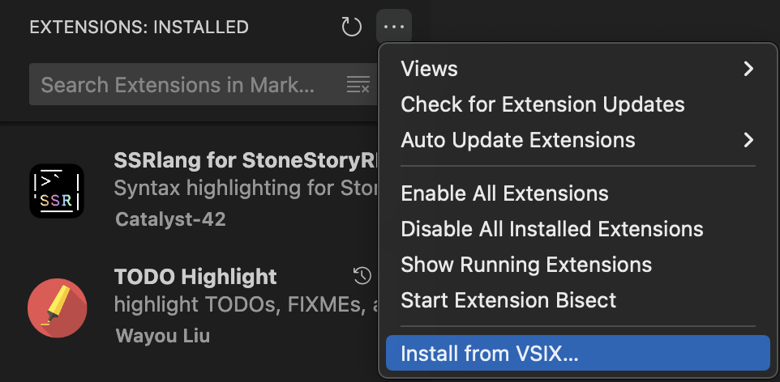

# Stonescript language (.ssr) for Visual Studio Code
This is a stonescript language support extension. Created to make it easier to write scripts for the [Stone Story RPG](https://stonestoryrpg.com/stonescript/manual.html) game. 

## Features
+ Syntax highlighting
+ Docstrings on hover
+ Code completion
+ Parameter suggestions
+ Dedicated file extension '.ssr', no more messing up with '.txt'
+ Dedicated file icon for '.ssr' files in VS Code

## Installation
This repository comes with two .vsix files.
To install, go to Extensions page from VS Code, then follow the screenshot to locate 'Install from VSIX...':

Locate stonescript-ssr-1.0.14.vsix and vscode-icons-12.8.9.vsix and install them.

## Samples
Theme: [Material Dark](https://marketplace.visualstudio.com/items?itemName=romanrei.material-dark)  
Coloring

Simple script

Hover

Completion

## Known issues
+ This is not an actual Lexer / Parser, all code checking based on many regex expressions
+ Somethimes docstring does not match to actual function (especially for variable with ui / BigNumber data types)

<!-- https://raw.githubusercontent.com/Catalyst-42/stonescript/main/img/IMAGE_FILE.png -->

## Outro
You will still have to convert the '.ssr' files to '.txt' before importing them into the game.
Simply change the '.ssr' extension to '.txt' to convert the file

Projects forked from:

https://github.com/Catalyst-42/stonescript for Stonescript editor functionality

https://github.com/vscode-icons/vscode-icons for changing VS Code file icons
